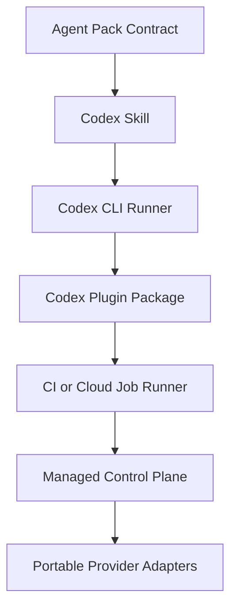

# Managed-Agent Platform Target

This document defines the destination architecture. It is intentionally stricter than the current implementation so the framework does not mistake slash-command skills for managed autonomy.

## CTO Verdict

The right foundation is still the safe adapter-first path:

1. Agent pack contract.
2. Codex adapter and validator.
3. Codex-native behavior runner with clean-room receipts.
4. Repeated-run variance and second-opinion evaluation.
5. Plugin packaging plus packaging variance.
6. Remote/cloud orchestration.
7. Governed memory and self-improvement.

Skipping straight to hosted agents would hide the most dangerous unknowns: runtime drift, weak evals, global install risk, memory poisoning, policy bypass, and unclear human escalation.

## Control Plane Components

| Component | Purpose | V1 Status |
|---|---|---:|
| Agent registry | Stores pack id, version, mission, risk tier, runtimes, and skills | Pack manifest only |
| Policy engine | Decides allowed sandbox, write permissions, approval needs, and escalation | Markdown policies plus runner checks |
| Job broker | Accepts tasks, selects agent pack, sets runtime, tracks status | Not built |
| Runtime adapters | Codex CLI, Codex app-server, plugin, CI, cloud, Claude, local model | Codex skill, clean-room CLI adapter, and disposable Codex plugin packaging gate |
| Workspace isolation | Creates disposable or worktree-bound execution environments | Disposable behavior workspace |
| Receipt store | Persists prompt, runtime, checks, evidence, outputs, risks, rollback | Local JSON receipts |
| Evaluator | Grades outputs against mechanical, semantic, second-opinion, variance, and packaging criteria | Mechanical checks, hidden deterministic semantic rubrics, deterministic second-opinion checks, repeated-run variance gate, plugin packaging variance gate, and negative harness fixtures |
| Memory ledger | Promotes only sourced, confidence-scored, expiring memories | Policy only |
| Self-improvement queue | Proposes pack or skill changes, requires eval and approval before promotion | Policy only |
| Human escalation | Asks minimum blocking questions and routes high-risk approvals | Skill instruction only |
| Observability | Tracks cost, duration, failures, drift, and repeat incidents | Partial Codex usage capture |
| Job contract | Defines pack, task, runtime, autonomy tier, policy, workspace, eval gate, and receipt target | `spec/managed-job.schema.json` |
| CI runner | Replays promotion gates from a fresh checkout | Static GitHub Actions job plus manual authenticated full Codex job |

## Runtime Ladder

## Hard Stops

- A skill is not a managed agent. It is reusable behavior and context.
- A plugin is not a control plane. It is a distribution package.
- `codex exec` is not a scheduler. It is a non-interactive runtime entrypoint.
- Local user config is not neutral. Promotion evidence should use clean-room execution with temporary auth-only `CODEX_HOME`; user config mode is diagnostic only.
- A job contract is not a queue or hosted service. It is an auditable envelope for a future control plane.
- Local app-server is not a public remote service. Treat WebSocket mode as local or securely tunneled only.
- Subagents are not automatic background workers. Codex spawns them only when explicitly asked.
- Memory is not proof. It is a pointer to evidence that may be stale.
- Self-improvement is proposal-only until tests, evals, and approval promote it.

## Autonomy Tiers

| Tier | Allowed | Required Guardrail |
|---|---|---|
| A0 Read-only | Research, review, summarize, grade, recommend | Receipt and evidence |
| A1 Draft-only | Create patches or docs in isolated branch/workspace | Diff, tests, rollback |
| A2 Write-safe | Modify repo files in approved scope | Policy gate, tests, human review |
| A3 External mutation | Deploy, billing, secrets, databases, production data | Explicit human approval |
| A4 Self-improvement | Propose skill or policy changes | Eval pass plus human approval |

## Managed Platform Acceptance Criteria

The platform is not ready to call managed until it can prove:

1. Every task has a job id, agent pack version, runtime, prompt, policy, and receipt.
2. Every write or external mutation has a policy decision and rollback path.
3. Every autonomous loop has a stop condition, timeout, and failure state.
4. Every memory promotion has source, confidence, expiry, and reason.
5. Every self-improvement proposal is evaluated before being adopted.
6. Every runtime adapter can say what it cannot do.
7. Mobile or web access uses a real remote runtime, not the user's offline PC.
8. Semantic quality is measured by adversarial evals, not by the agent's confidence.
9. Harnesses prove both pass and fail paths before their receipts are trusted.
10. Repeated-run variance stays inside explicit thresholds before packaging or provider parity claims.
11. Plugin packaging proves local disposable install/discovery before normal profile install, sharing, CI, cloud, mobile, or provider parity claims.
12. Plugin packaging variance proves stable package fingerprints, marketplace fingerprints, CLI install behavior, and prompt-input discovery before public/repo packaging or remote claims.
13. Remote proof requires the manual authenticated full Codex GitHub Actions job to pass; static CI alone is not autonomy evidence.

## Next Build Order

1. Push the dedicated `mithunyc/agent-launch-framework` repo without parent `titan-research` state.
2. Configure `OPENAI_API_KEY` and prove the manual authenticated full Codex GitHub Actions job.
3. Add public/repo marketplace packaging only after disposable packaging remains stable locally and in CI.
4. Add a local job queue only after the job contract and gates stay stable.
5. Add remote execution through Codex cloud where available.
6. Add memory proposal review and promotion.
7. Add provider adapters only after the pack contract survives real Codex behavior tests and remote receipts.
